# Project 6 - Web Solution with WordPress

---

## Step 1 - Setup Web Server

- Launch a new EC2 instance `webserver`
    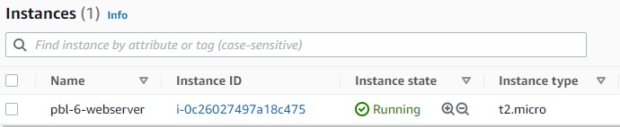
- Create 3 Volumes of 10GB each within the same Availability Zone as the previously created instance
    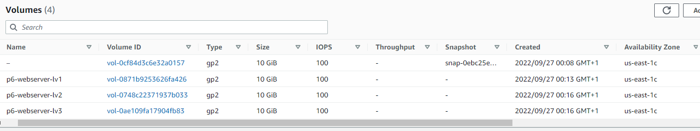
- Attach each volume to the `webserver` instance
    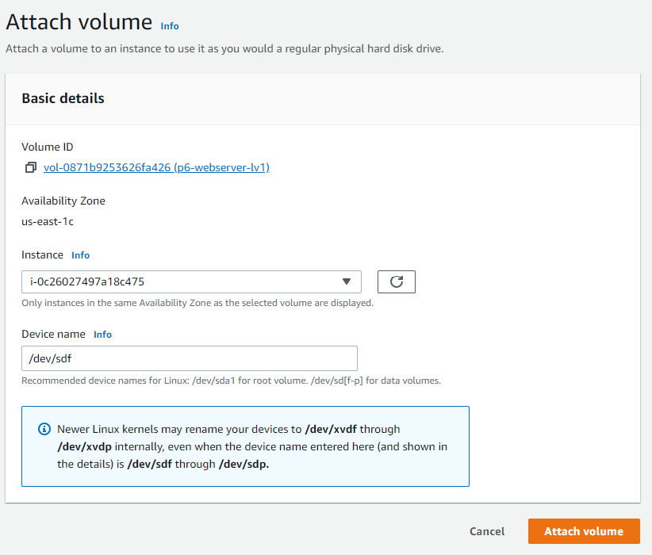
    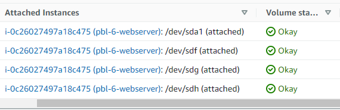
- Connect to `webserver` instance via terminal
- Inspect devices by using the `lsblk` command
    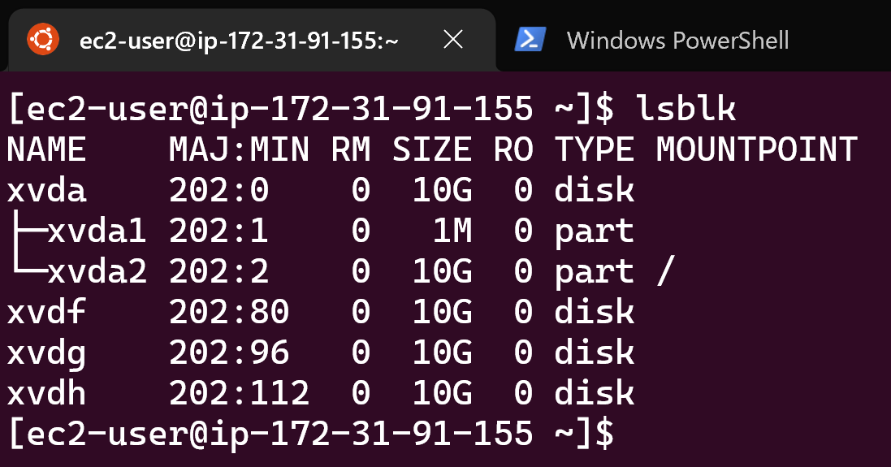
- Create a single partition on each attached disks using the `gdisk` utility:
    ```
    sudo gdisk /dev/xvd[f,g,h]
    ```
    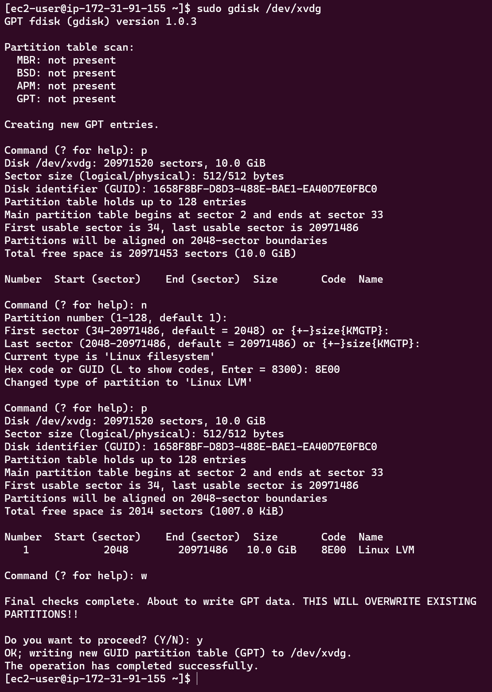
- Use `lsblk` to view devices and new partitions
    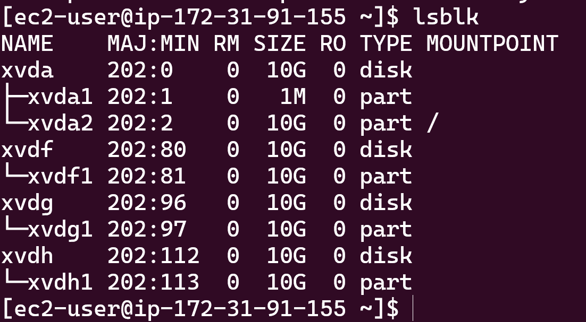
- Install `lvm2` package:
    ```
    sudo yum install lvm2
    ```
- Check for available partitions:
    ```
    sudo lvmdiskscan
    ```
    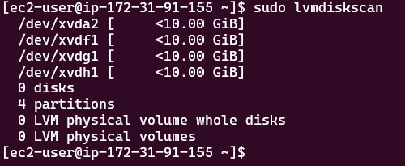
- Mark each partition previously created as physical volumes to be used by `lvm`:
    ```
    sudo pvcreate /dev/xvdf1
    sudo pvcreate /dev/xvdg1
    sudo pvcreate /dev/xvdh1
    ```
    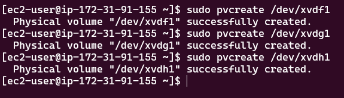
- Use the `pvs` command to verify and view newly created physical volumes:
    ```
    sudo pvs
    ```
    
- Add all 3 physical volumes to a volume group called `webdata-vg`:
    ```
    sudo vgcreate webdata-vg /dev/xvdf1 /dev/xvdg1 /dev/xvdh1
    ```
    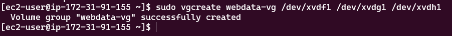
- Use the `vgs` command to verify and view newly created volume group:
    ```
    sudo vgs
    ```
    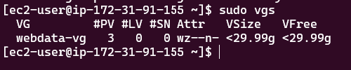
- Create two logical volumes using the `lvcreate` utility. Create `apps-lv` (for storing data for the website) using half the PV size, and `logs-lv` (for storing logs data) using the remaining space.
    ```
    sudo lvcreate -n apps-lv -L 14G webdata-vg
    sudo lvcreate -n logs-lv -L 14G webdata-vg
    ```
    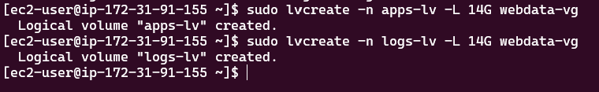
- Use the `lvs` command to verify and view newly created logical volumes:
    ```
    sudo lvs
    ```
    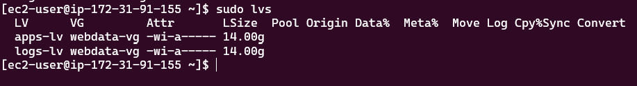
- Verify entire setup:
    ```
    sudo vgdisplay -v #view complete setup - VG, PV, and LV
    sudo lsblk
    ```
    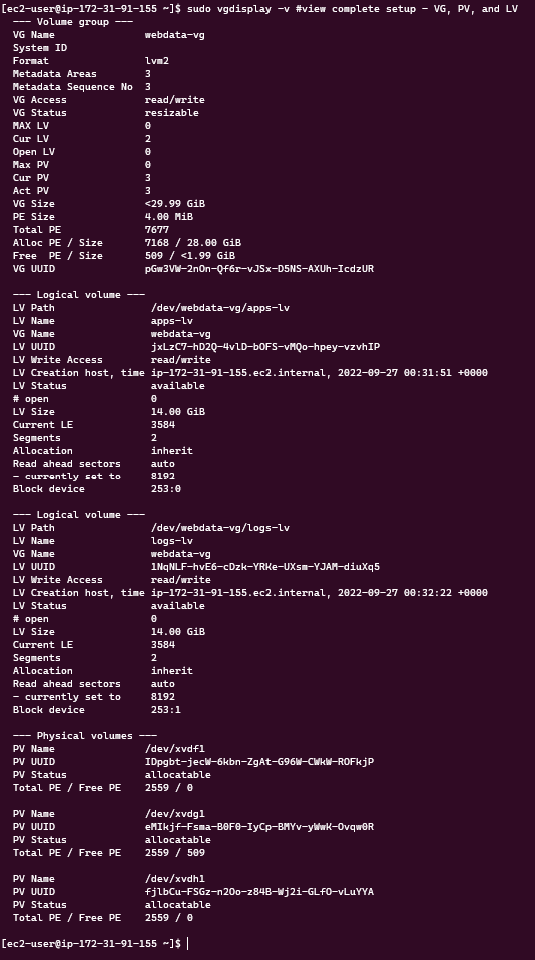
    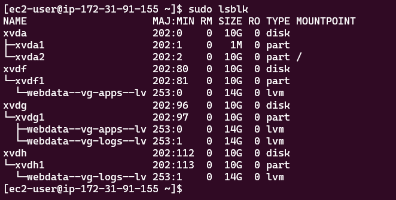
- Format logical volumes with `ext4` filesystem:
    ```
    sudo mkfs -t ext4 /dev/webdata-vg/apps-lv
    sudo mkfs -t ext4 /dev/webdata-vg/logs-lv
    ```
    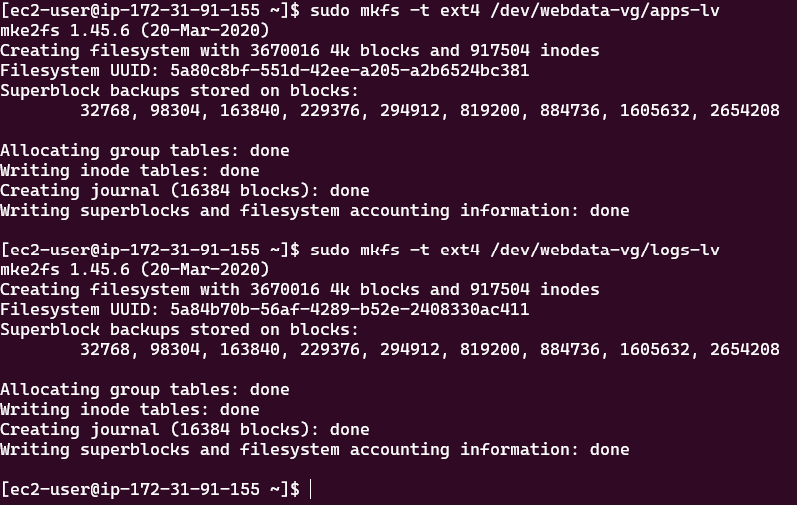
- Create directory for storing website files `/var/www/html`:
    ```
    sudo mkdir -p /var/www/html
    ```
- Create directory for storing log data backup `/home/recovery/logs`:
    ```
    sudo mkdir -p /home/recovery/logs
    ```
- Mount `/var/www/html` on `apps-lv` logical volume:
    ```
    sudo mount /dev/webdata-vg/apps-lv /var/www/html/
    ```
- Before mounting on `logs-lv`, use `rsync` utility to backup all files in the log directory `/var/log` into `/home/recovery/logs`:
    ```
    sudo rsync -av /var/log/. /home/recovery/logs/
    ```
- Mount `/var/log` on `logs-lv` logical volume:
    ```
    sudo mount /dev/webdata-vg/logs-lv /var/log
    ```
- Restore log files back into `/var/log` directory:
    ```
    sudo rsync -av /home/recovery/logs/. /var/log/
    ```

### Update `/etc/fstab` file to ensure mount configuration persists after restart of the server

- Copy out device UUID of `apps-lv` and `logs-lv` using `sudo blkid` to display them
    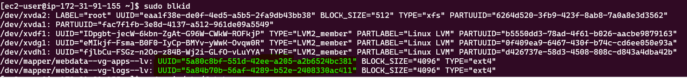
- Edit and update `fstab` file. Insert UUID of mounted LVs (remember to remove leading and ending quotes):
    ```
    sudo vi /etc/fstab
    ```
    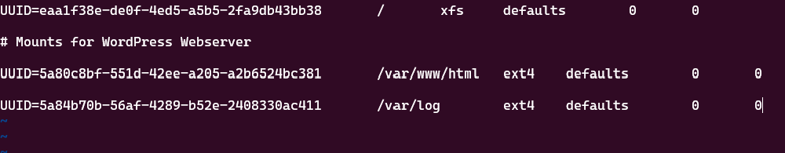
- Test configurations and reload daemon:
    ```
    sudo mount -a
    sudo systemctl daemon-reload
    ```
- Verify and view devices setup by using `df -h`
    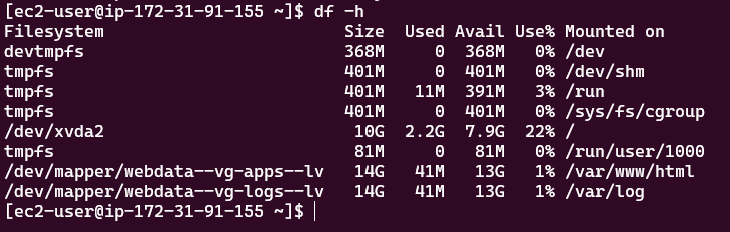


---

## Step 2 - Setup Database Server
*Follow the same steps as for `webserver`*

- Launch a new EC2 instance `dbserver`
- Create 3 Volumes of 10GB each within the same Availability Zone as the previously created instance
- Attach each volume to the `dbserver` instance
- Connect to `dbserver` instance via terminal
- Create a single partition on each attached disks using the `gdisk` utility:
    ```
    sudo gdisk /dev/xvd[f,g,h]
    ```
- Use `lsblk` to view devices and new partitions
- Install `lvm2` package:
    ```
    sudo yum install lvm2
    ```
- Check for available partitions:
    ```
    sudo lvmdiskscan
    ```
- Mark each partition previously created as physical volumes to be used by `lvm`:
    ```
    sudo pvcreate /dev/xvdf1
    sudo pvcreate /dev/xvdg1
    sudo pvcreate /dev/xvdh1
    ```
- Use the `pvs` command to verify and view newly created physical volumes:
    ```
    sudo pvs
    ```
- Add all 3 physical volumes to a volume group called `dbdata-vg`:
    ```
    sudo vgcreate dbdata-vg /dev/xvdf1 /dev/xvdg1 /dev/xvdh1
    ```
- Use the `vgs` command to verify and view newly created volume group:
    ```
    sudo vgs
    ```
- Create two logical volumes using the `lvcreate` utility. Create `db-lv` using half the PV size, and `logs-lv` (for storing logs data) using the remaining space.
    ```
    sudo lvcreate -n db-lv -L 14G dbdata-vg
    sudo lvcreate -n logs-lv -L 14G dbdata-vg
    ```
- Use the `lvs` command to verify and view newly created logical volumes:
    ```
    sudo lvs
    ```
- Verify entire setup:
    ```
    sudo vgdisplay -v #view complete setup - VG, PV, and LV
    sudo lsblk
    ```
- Format logical volumes with `ext4` filesystem:
    ```
    sudo mkfs -t ext4 /dev/dbdata-vg/db-lv
    sudo mkfs -t ext4 /dev/dbdata-vg/logs-lv
    ```
- Create directory for storing website files `/db`:
    ```
    sudo mkdir -p /db
    ```
- Create directory for storing log data backup `/home/recovery/logs`:
    ```
    sudo mkdir -p /home/recovery/logs
    ```
- Mount `/db` on `db-lv` logical volume:
    ```
    sudo mount /dev/dbdata-vg/db-lv /db/
    ```
- Before mounting on `logs-lv`, use `rsync` utility to backup all files in the log directory `/var/log` into `/home/recovery/logs`:
    ```
    sudo rsync -av /var/log/. /home/recovery/logs/
    ```
- Mount `/var/log` on `logs-lv` logical volume:
    ```
    sudo mount /dev/dbdata-vg/logs-lv /var/log
    ```
- Restore log files back into `/var/log` directory:
    ```
    sudo rsync -av /home/recovery/logs/. /var/log/
    ```
- Copy out device UUID of `db-lv` and `logs-lv` using `sudo blkid` to display them
- Edit and update `fstab` file. Insert UUID of mounted LVs (remember to remove leading and ending quotes):
    ```
    sudo vi /etc/fstab
    ```
- Test configurations and reload daemon:
    ```
    sudo mount -a
    sudo systemctl daemon-reload
    ```
- Verify and view devices setup by using `df -h`
    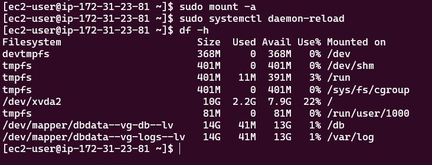


---


