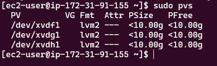
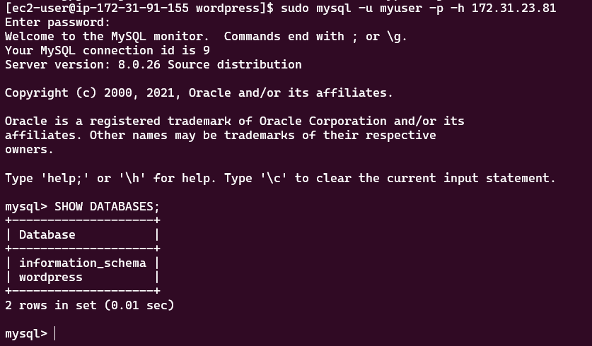
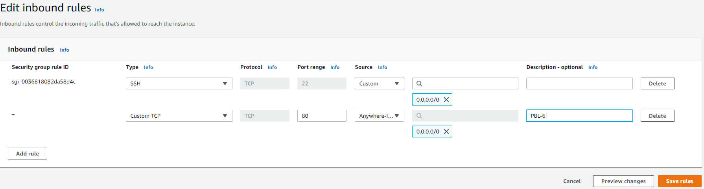
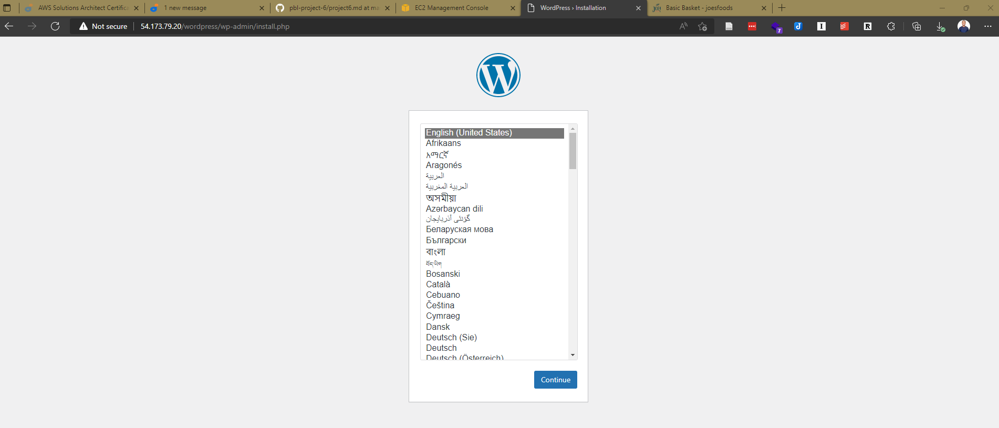

# Project 6 - Web Solution with WordPress

---

## Step 1 - Setup Web Server

- Launch a new EC2 instance `webserver`
    
- Create 3 Volumes of 10GB each within the same Availability Zone as the previously created instance
    
- Attach each volume to the `webserver` instance
    
    
- Connect to `webserver` instance via terminal
- Inspect devices by using the `lsblk` command
    
- Create a single partition on each attached disks using the `gdisk` utility:
    ```
    sudo gdisk /dev/xvd[f,g,h]
    ```
    
- Use `lsblk` to view devices and new partitions
    
- Install `lvm2` package:
    ```
    sudo yum install lvm2
    ```
- Check for available partitions:
    ```
    sudo lvmdiskscan
    ```
    
- Mark each partition previously created as physical volumes to be used by `lvm`:
    ```
    sudo pvcreate /dev/xvdf1
    sudo pvcreate /dev/xvdg1
    sudo pvcreate /dev/xvdh1
    ```
    
- Use the `pvs` command to verify and view newly created physical volumes:
    ```
    sudo pvs
    ```
    
- Add all 3 physical volumes to a volume group called `webdata-vg`:
    ```
    sudo vgcreate webdata-vg /dev/xvdf1 /dev/xvdg1 /dev/xvdh1
    ```
    
- Use the `vgs` command to verify and view newly created volume group:
    ```
    sudo vgs
    ```
    
- Create two logical volumes using the `lvcreate` utility. Create `apps-lv` (for storing data for the website) using half the PV size, and `logs-lv` (for storing logs data) using the remaining space.
    ```
    sudo lvcreate -n apps-lv -L 14G webdata-vg
    sudo lvcreate -n logs-lv -L 14G webdata-vg
    ```
    
- Use the `lvs` command to verify and view newly created logical volumes:
    ```
    sudo lvs
    ```
    
- Verify entire setup:
    ```
    sudo vgdisplay -v #view complete setup - VG, PV, and LV
    sudo lsblk
    ```
    
    
- Format logical volumes with `ext4` filesystem:
    ```
    sudo mkfs -t ext4 /dev/webdata-vg/apps-lv
    sudo mkfs -t ext4 /dev/webdata-vg/logs-lv
    ```
    
- Create directory for storing website files `/var/www/html`:
    ```
    sudo mkdir -p /var/www/html
    ```
- Create directory for storing log data backup `/home/recovery/logs`:
    ```
    sudo mkdir -p /home/recovery/logs
    ```
- Mount `/var/www/html` on `apps-lv` logical volume:
    ```
    sudo mount /dev/webdata-vg/apps-lv /var/www/html/
    ```
- Before mounting on `logs-lv`, use `rsync` utility to backup all files in the log directory `/var/log` into `/home/recovery/logs`:
    ```
    sudo rsync -av /var/log/. /home/recovery/logs/
    ```
- Mount `/var/log` on `logs-lv` logical volume:
    ```
    sudo mount /dev/webdata-vg/logs-lv /var/log
    ```
- Restore log files back into `/var/log` directory:
    ```
    sudo rsync -av /home/recovery/logs/. /var/log/
    ```

### Update `/etc/fstab` file to ensure mount configuration persists after restart of the server

- Copy out device UUID of `apps-lv` and `logs-lv` using `sudo blkid` to display them
    
- Edit and update `fstab` file. Insert UUID of mounted LVs (remember to remove leading and ending quotes):
    ```
    sudo vi /etc/fstab
    ```
    
- Test configurations and reload daemon:
    ```
    sudo mount -a
    sudo systemctl daemon-reload
    ```
- Verify and view devices setup by using `df -h`
    


---

## Step 2 - Setup Database Server
*Follow the same steps as for `webserver`*

- Launch a new EC2 instance `dbserver`
- Create 3 Volumes of 10GB each within the same Availability Zone as the previously created instance
- Attach each volume to the `dbserver` instance
- Connect to `dbserver` instance via terminal
- Create a single partition on each attached disks using the `gdisk` utility:
    ```
    sudo gdisk /dev/xvd[f,g,h]
    ```
- Use `lsblk` to view devices and new partitions
- Install `lvm2` package:
    ```
    sudo yum install lvm2
    ```
- Check for available partitions:
    ```
    sudo lvmdiskscan
    ```
- Mark each partition previously created as physical volumes to be used by `lvm`:
    ```
    sudo pvcreate /dev/xvdf1
    sudo pvcreate /dev/xvdg1
    sudo pvcreate /dev/xvdh1
    ```
- Use the `pvs` command to verify and view newly created physical volumes:
    ```
    sudo pvs
    ```
- Add all 3 physical volumes to a volume group called `dbdata-vg`:
    ```
    sudo vgcreate dbdata-vg /dev/xvdf1 /dev/xvdg1 /dev/xvdh1
    ```
- Use the `vgs` command to verify and view newly created volume group:
    ```
    sudo vgs
    ```
- Create two logical volumes using the `lvcreate` utility. Create `db-lv` using half the PV size, and `logs-lv` (for storing logs data) using the remaining space.
    ```
    sudo lvcreate -n db-lv -L 14G dbdata-vg
    sudo lvcreate -n logs-lv -L 14G dbdata-vg
    ```
- Use the `lvs` command to verify and view newly created logical volumes:
    ```
    sudo lvs
    ```
- Verify entire setup:
    ```
    sudo vgdisplay -v #view complete setup - VG, PV, and LV
    sudo lsblk
    ```
- Format logical volumes with `ext4` filesystem:
    ```
    sudo mkfs -t ext4 /dev/dbdata-vg/db-lv
    sudo mkfs -t ext4 /dev/dbdata-vg/logs-lv
    ```
- Create directory for storing website files `/db`:
    ```
    sudo mkdir -p /db
    ```
- Create directory for storing log data backup `/home/recovery/logs`:
    ```
    sudo mkdir -p /home/recovery/logs
    ```
- Mount `/db` on `db-lv` logical volume:
    ```
    sudo mount /dev/dbdata-vg/db-lv /db/
    ```
- Before mounting on `logs-lv`, use `rsync` utility to backup all files in the log directory `/var/log` into `/home/recovery/logs`:
    ```
    sudo rsync -av /var/log/. /home/recovery/logs/
    ```
- Mount `/var/log` on `logs-lv` logical volume:
    ```
    sudo mount /dev/dbdata-vg/logs-lv /var/log
    ```
- Restore log files back into `/var/log` directory:
    ```
    sudo rsync -av /home/recovery/logs/. /var/log/
    ```
- Copy out device UUID of `db-lv` and `logs-lv` using `sudo blkid` to display them
- Edit and update `fstab` file. Insert UUID of mounted LVs (remember to remove leading and ending quotes):
    ```
    sudo vi /etc/fstab
    ```
- Test configurations and reload daemon:
    ```
    sudo mount -a
    sudo systemctl daemon-reload
    ```
- Verify and view devices setup by using `df -h`
    


---


## Step 3 - Setup WordPress on Web Server

- Update the repository:
    ```
    sudo yum -y update
    ```
- Install wget, Apache and needed dependencies:
    ```
    sudo yum -y install wget httpd php php-mysqlnd php-fpm php-json
    ```
- Start Apache webserver:
    ```
    sudo systemctl enable httpd
    sudo systemctl start httpd
    ```
- Install PHP and it's dependencies:
    ```
    sudo yum install https://dl.fedoraproject.org/pub/epel/epel-release-latest-8.noarch.rpm
    sudo yum install yum-utils http://rpms.remirepo.net/enterprise/remi-release-8.rpm
    sudo yum module list php
    sudo yum module reset php
    sudo yum module enable php:remi-7.4
    sudo yum install php php-opcache php-gd php-curl php-mysqlnd
    sudo systemctl start php-fpm
    sudo systemctl enable php-fpm
    setsebool -P httpd_execmem 1
    ```
- Restart Apache:
    ```
    sudo systemctl restart httpd
    ```
- Download WordPress:
    ```
    mkdir wordpress && cd wordpress
    sudo wget http://wordpress.org/latest.tar.gz
    ```
- Extract package:
    ```
    sudo tar xzvf latest.tar.gz
    ```
- Delete downloaded package:
    ```
    sudo rm -rf latest.tar.gz
    ```
- Create copy of `wp-config-sample.php`:
    ```
    cp wordpress/wp-config-sample.php wordpress/wp-config.php
    ```
- Copy `wordpress` directory to `var/www/html`:
    ```
    cp -R wordpress /var/www/html/
    ```
- Configure SELinux Policies:
    ```
    sudo chown -R apache:apache /var/www/html/wordpress
    sudo chcon -t httpd_sys_rw_content_t /var/www/html/wordpress -R
    sudo setsebool -P httpd_can_network_connect=1
    ```

---


## Step 4 - Setup MySQL on Database Server

- Update the repository:
    ```
    sudo yum -y update
    ```
- Install `mysql-server`:
    ```
    sudo yum install mysql-server
    ```
- Restart and enable service:
    ```
    sudo systemctl restart mysqld
    sudo systemctl enable mysqld
    ```

---


## Step 5 - Configure Database for WordPress

- Enter MySQL console:
    ```
    sudo mysql
    ```
- Create Database called `wordpress`:
    ```
    CREATE DATABASE wordpress;
    ```
- Create user:
    ```
    CREATE USER `myuser`@`<private-ip>` IDENTIFIED BY 'mypassword';
    ```
- Grant database privileges to the user:
    ```
    GRANT ALL ON wordpress.* TO 'myuser'@'<private-ip>';
    FLUSH PRIVILEGES;
    exit
    ```
- Open port `3306` and allow access only to `webserver` 
- Open and edit `mysql` configuration file:
    ```
    sudo vi /etc/my.cnf
    ```
- Insert the following settings:
    ```
    [mysqld]
    Bind-address=0.0.0.0
    ```

---

## Step 6 - Configure WordPress to Connect to Remote DB

- Install `mysql-client` on `webserver`:
    ```
    sudo yum install mysql-client
    ```
- Login to remote database:
    ```
    sudo mysql -u myuser -p -h 172.31.23.81
    ```
    
- Open port `80` on `webserver` for `http` access in EC2
    
- Edit `wp-config.php` and fill in database details
- Visit <ip-address>/wordpress
    